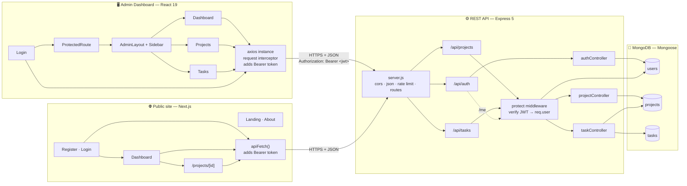
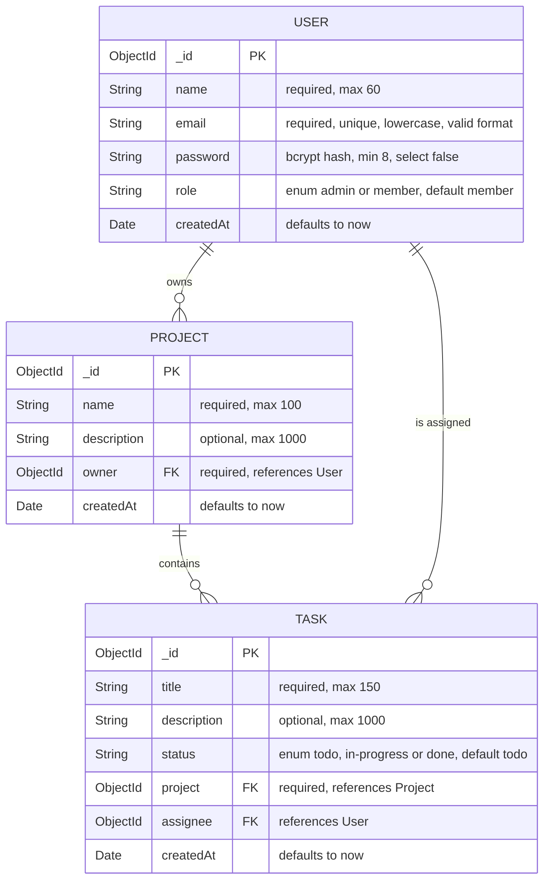
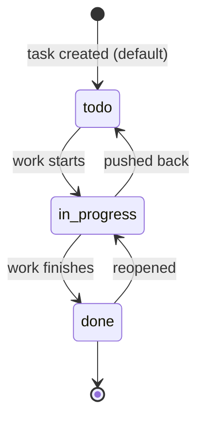
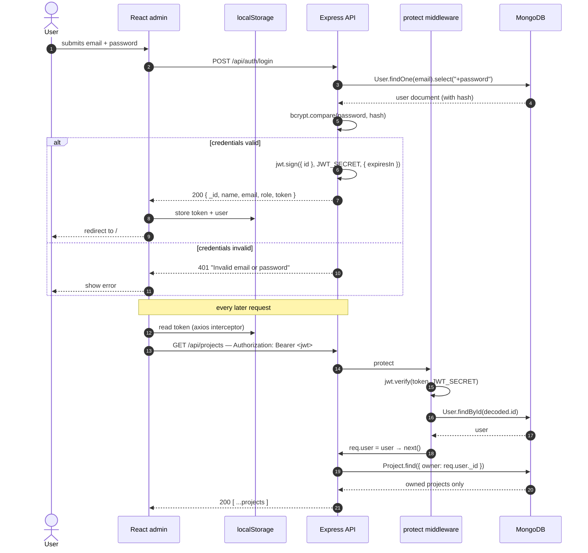
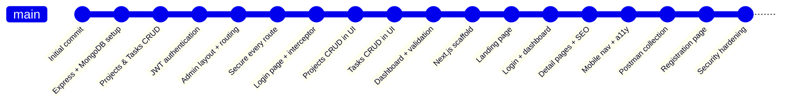

# TaskFlow

> A full-stack project & task management platform — built during my internship at Compu-Vision.

TaskFlow is made of three apps talking to one API:

- a secure **REST API** built with **Express + MongoDB**
- a **React** admin dashboard for managing projects and tasks
- a **Next.js** public site with a landing page, sign-up, and a read-only dashboard

Users sign up with email and password, receive a JWT, and manage their own projects and the tasks
inside them. Every record is scoped to its owner — you can only ever see and touch your own data.

<p align="left">
  
  
  
  
  
  
  
  
  
</p>

---

## Table of contents

- [Features](#features)
- [Tech stack](#tech-stack)
- [Architecture](#architecture)
- [Database design](#database-design)
- [Authentication flow](#authentication-flow)
- [Authorization model](#authorization-model)
- [Security hardening](#security-hardening)
- [Project structure](#project-structure)
- [Getting started](#getting-started)
- [Environment variables](#environment-variables)
- [API reference](#api-reference)
- [Development log](#development-log)
- [Known limitations](#known-limitations)
- [Roadmap](#roadmap)

---

## Features

**Backend API**
- 🔐 Email + password registration and login, passwords hashed with **bcrypt**
- 🎟️ Stateless **JWT** sessions (`Bearer` tokens, configurable expiry)
- 🛡️ `protect` middleware guarding every project and task route
- 📁 Full **CRUD** for projects, scoped to the logged-in owner
- ✅ Full **CRUD** for tasks, with ownership derived from the parent project
- 🧹 Deleting a project **cascades** to its tasks, so no orphaned records are left behind
- 🧱 **Rate limiting** on login and registration against brute-force attempts
- 🧾 Schema-level **validation** with clear, human-readable error messages
- 🚦 Server only starts listening **after** MongoDB connects, so there's no window where the API answers without a database

**Admin dashboard** (React)
- 🔑 Login page that stores the JWT and redirects into the app
- 🧭 Persistent sidebar layout with active-link highlighting and logout
- 🚧 `ProtectedRoute` wrapper — no token, no dashboard
- 📊 Dashboard with live counts (projects, tasks, to-do / in-progress / done) and a recent-tasks list
- 📝 Projects and Tasks pages with inline create / edit / delete, loading and saving states, client-side validation, and empty-state guidance
- 🤝 Axios instance that attaches the token to every call, and logs the user out automatically when the token expires

**Public site** (Next.js)
- 🏠 Responsive landing page, About page, and custom 404
- ✍️ Sign-up and login pages
- 📂 Dashboard of the user's projects, each linking to a **dynamic detail page** (`/projects/[id]`) with tasks grouped by status
- 🔄 Navbar and pages stay in sync with login state, including across browser tabs
- 📱 Mobile navigation menu, keyboard-visible focus styles, and a skip-to-content link
- 🔎 SEO metadata, `robots.txt` and `sitemap.xml`, with private pages marked `noindex`
- 💯 Lighthouse (landing page): Performance 98 · Accessibility 100 · Best Practices 100 · SEO 91

---

## Tech stack

| Layer | Technology |
| --- | --- |
| Runtime | Node.js (CommonJS) |
| API framework | Express 5 |
| Database | MongoDB |
| ODM | Mongoose 9 |
| Auth | jsonwebtoken + bcryptjs |
| Config | dotenv |
| Cross-origin | cors (allowlist) |
| Rate limiting | express-rate-limit |
| Admin frontend | React 19 (Create React App) |
| Admin routing | React Router 7 |
| Admin HTTP client | Axios |
| Public frontend | Next.js 16 (App Router) |
| Styling | Tailwind CSS |
| Dev tooling | nodemon |

---

## Architecture



---

## Database design

Three collections, related by `ObjectId` references. A **User** owns many **Projects**; a **Project**
holds many **Tasks**; a **Task** may be assigned to a **User**.



### Task lifecycle

`status` is constrained by the schema enum, and the dashboard counts each bucket:



> **Cascading deletes:** deleting a project first removes all of its tasks, then the project itself.
> MongoDB has no `ON DELETE CASCADE`, so `deleteProject` does this in code.

---

## Authentication flow



---

## Authorization model

Authentication proves *who you are*; these checks decide *what you may touch*.

| Resource | Rule | On violation |
| --- | --- | --- |
| `GET /api/projects` | Query is filtered to `{ owner: req.user._id }` | Other users' projects are simply never returned |
| `GET/PUT/DELETE /api/projects/:id` | `project.owner` must equal `req.user._id` | `403 Forbidden` |
| `POST /api/tasks` | The target `project` must be owned by the caller | `403 Forbidden` |
| `GET /api/tasks` | Tasks are fetched only for projects the caller owns | Foreign tasks are never returned |
| `GET/PUT/DELETE /api/tasks/:id` | The task's parent project must be owned by the caller | `403 Forbidden` |
| `DELETE /api/projects/:id` | Owner only; the project's tasks are deleted with it | `403 Forbidden` |
| Any protected route without a valid token | `protect` rejects before the controller runs | `401 Not authorized` |
| Any `/:id` route with a malformed ID | `validateObjectId` rejects before the database is queried | `400 Invalid ID format` |

Passwords are stored as bcrypt hashes (10 salt rounds) and the `password` field is marked
`select: false`, so it never leaks into a normal query result — the login handler opts in explicitly
with `.select("+password")`.

---

## Security hardening

| Threat | Defence |
| --- | --- |
| Password brute-forcing | `express-rate-limit`: 10 requests per 15 minutes per IP on `/api/auth`, 200 on the rest → `429` |
| Weak passwords | Minimum length enforced **on the server** by the schema, not just in the browser |
| Spoofed ownership | `owner` is always taken from the verified token, never from the request body |
| NoSQL operator injection (`{"email": {"$gt": ""}}`) | Auth inputs are coerced to plain strings before querying |
| Leaking internals in errors | `utils/handleError.js` turns validation errors into clear `400`s and hides unexpected errors behind a generic `500` |
| Oversized or malformed bodies | JSON bodies capped at 10 kB (`413`); malformed JSON returns a clean `400` |
| Cross-origin abuse | CORS allowlist from `CLIENT_URLS` instead of allowing every origin |
| Duplicate-email race | The `unique` index is the real guarantee; its error is mapped to the same `409` as the pre-check |
| Deleted users with live tokens | `protect` re-loads the user from the database on every request |

---

## Project structure

```
TaskFlow/
├── server.js                     # App entry — CORS, body limits, rate limits, routes, error handling
├── .env.example                  # Backend environment template
├── package.json
│
├── src/                          # ── Backend ──────────────────────────────
│   ├── db.js                     # Mongoose connection (exits the process on failure)
│   ├── models/
│   │   ├── User.js               # Schema + validation + pre-save bcrypt hook + matchPassword()
│   │   ├── Project.js            # Schema with owner → User
│   │   └── Task.js               # Schema with project → Project, assignee → User
│   ├── middleware/
│   │   ├── auth.js               # protect: verifies the JWT and loads req.user
│   │   ├── rateLimiter.js        # authLimiter + apiLimiter
│   │   └── validateObjectId.js   # 400 for malformed :id params
│   ├── utils/
│   │   └── handleError.js        # Maps errors to safe, readable API responses
│   ├── controllers/
│   │   ├── authController.js     # register · login · getMe
│   │   ├── projectController.js  # CRUD + ownership checks + cascade delete
│   │   └── taskController.js     # CRUD + ownsProject() helper
│   └── routes/
│       ├── authRoutes.js         # /api/auth
│       ├── projectRoutes.js      # /api/projects  (all protected)
│       └── taskRoutes.js         # /api/tasks     (all protected)
│
├── admin/                        # ── Admin dashboard (Create React App) ───
│   ├── .env.example              # REACT_APP_API_URL
│   └── src/
│       ├── App.js                # Router, Sidebar, AdminLayout, route tree
│       ├── api/axios.js          # Client + auth interceptor + auto-logout on 401
│       ├── components/ProtectedRoute.jsx
│       └── pages/                # Login · Dashboard · Projects · Tasks
│
├── frontend/                     # ── Public site (Next.js App Router) ─────
│   ├── .env.example              # NEXT_PUBLIC_API_URL, NEXT_PUBLIC_SITE_URL
│   └── src/
│       ├── app/
│       │   ├── layout.js         # Navbar, footer, skip link, site-wide metadata
│       │   ├── page.js           # Landing page
│       │   ├── about/ · login/ · register/ · dashboard/
│       │   ├── projects/[id]/    # Dynamic project detail page
│       │   ├── robots.js · sitemap.js · loading.js · not-found.js
│       ├── components/           # AuthNav · MobileNav · ProjectCard · TaskItem · StatusBadge
│       └── lib/                  # api.js (fetch wrapper) · useRequireAuth.js
│
└── docs/                         # Postman collection + environment
```

---

## Getting started

### Prerequisites

- **Node.js** 18 or newer
- A **MongoDB** database — a local `mongod` instance or a free MongoDB Atlas cluster

### 1. Clone the repository

```bash
git clone https://github.com/MichaelAzar-C/TaskFlow.git
cd TaskFlow
```

### 2. Start the API

```bash
npm install
cp .env.example .env        # then fill in MONGO_URI and JWT_SECRET
npm run dev                 # nodemon — or `npm start` for plain node
```

The API comes up on `http://localhost:5000`. Hitting `/` should return `TaskFlow API is running`,
and the console prints `✅ MongoDB connected successfully` before the server begins listening.

### 3. Start the admin dashboard

In a second terminal:

```bash
cd admin
npm install
cp .env.example .env        # REACT_APP_API_URL=http://localhost:5000/api
npm start
```

The dashboard opens on `http://localhost:3000`.

### 4. Start the public site

In a third terminal:

```bash
cd frontend
npm install
cp .env.example .env.local
npm run dev -- -p 3001
```

The public site opens on `http://localhost:3001`.

### 5. Create your first account

Go to `http://localhost:3001/register` and sign up. The same credentials work on the admin
dashboard at `http://localhost:3000/login`, where you can create projects and tasks.

### Testing the API with Postman

Import `docs/TaskFlow API.postman_collection.json` and `docs/TaskFlow Local.postman_environment.json`,
select the **TaskFlow Local** environment, and run **Login** first — it stores the token
automatically. The collection includes negative cases (`401` without a token, `403` for a project
you don't own, ignored owner spoofing).

---

## Environment variables

**Backend** — `.env` in the repository root:

| Variable | Description | Example |
| --- | --- | --- |
| `PORT` | Port the API listens on | `5000` |
| `MONGO_URI` | MongoDB connection string | `mongodb://localhost:27017/taskflow` |
| `JWT_SECRET` | Secret used to sign and verify tokens | *a long random string* |
| `JWT_EXPIRES_IN` | Token lifetime | `7d` |
| `NODE_ENV` | `production` makes the API trust its host's proxy for client IPs | `development` |
| `CLIENT_URLS` | Comma-separated front-end origins allowed by CORS | `http://localhost:3000,http://localhost:3001` |

**Admin dashboard** — `admin/.env`:

| Variable | Description | Example |
| --- | --- | --- |
| `REACT_APP_API_URL` | Base URL of the API, including `/api` | `http://localhost:5000/api` |

**Public site** — `frontend/.env.local`:

| Variable | Description | Example |
| --- | --- | --- |
| `NEXT_PUBLIC_API_URL` | Base URL of the API, including `/api` | `http://localhost:5000/api` |
| `NEXT_PUBLIC_SITE_URL` | The site's own URL, used by `robots.txt` and `sitemap.xml` | `http://localhost:3001` |

> `.env` files are git-ignored. Only the `.env.example` templates are committed.

---

## API reference

Base URL: `http://localhost:5000/api`
🔒 = requires `Authorization: Bearer <token>`

Common responses on every route: `400` for validation errors or a malformed `:id`, `401` without a
valid token, `403` for a record you don't own, `404` when a record doesn't exist, `429` when rate
limited.

### Auth

| Method | Endpoint | Body | Description |
| --- | --- | --- | --- |
| `POST` | `/auth/register` | `name`, `email`, `password` (8+ chars) | Creates an account, returns the user + token. `409` if the email is taken. |
| `POST` | `/auth/login` | `email`, `password` | Returns the user + token. `401` on bad credentials. |
| `GET` | 🔒 `/auth/me` | — | Returns the currently authenticated user. |

### Projects — all 🔒

| Method | Endpoint | Body | Description |
| --- | --- | --- | --- |
| `POST` | `/projects` | `name`, `description` | Creates a project owned by the caller. |
| `GET` | `/projects` | — | Lists the caller's projects. |
| `GET` | `/projects/:id` | — | One project. `403` if not the owner, `404` if missing. |
| `PUT` | `/projects/:id` | `name?`, `description?` | Partial update of the owned project. |
| `DELETE` | `/projects/:id` | — | Deletes the owned project **and all of its tasks**. |

### Tasks — all 🔒

| Method | Endpoint | Body | Description |
| --- | --- | --- | --- |
| `POST` | `/tasks` | `title`, `description`, `status`, `project`, `assignee?` | Creates a task in a project the caller owns. `400` if `project` is missing. |
| `GET` | `/tasks` | — | Lists every task across the caller's projects, with `project` and `assignee` populated. |
| `GET` | `/tasks/:id` | — | One task, populated. |
| `PUT` | `/tasks/:id` | `title?`, `description?`, `status?`, `assignee?` | Partial update. |
| `DELETE` | `/tasks/:id` | — | Deletes the task. |

<details>
<summary><strong>Example: create a task</strong></summary>

```bash
curl -X POST http://localhost:5000/api/tasks \
  -H "Content-Type: application/json" \
  -H "Authorization: Bearer $TOKEN" \
  -d '{
    "title": "Design the database schema",
    "description": "Users, projects and tasks with references",
    "status": "in-progress",
    "project": "68c0f3a1b2c3d4e5f6a7b8c9"
  }'
```

</details>

---

## Development log

How the project came together, commit by commit.



### Week 1 — building the API

| Step | What was done |
| --- | --- |
| **Project scaffold** | Set up Express, `cors`, JSON body parsing and `dotenv`; created `src/db.js` for the Mongoose connection and laid out the `models / controllers / routes / middleware` folder structure. |
| **Data model** | Defined the `User`, `Project` and `Task` schemas with their `ObjectId` references, the `status` and `role` enums, and `createdAt` defaults. |
| **CRUD endpoints** | Built five endpoints each for projects and tasks, wired through dedicated controllers and routers mounted at `/api/projects` and `/api/tasks`. |
| **Authentication** | Added bcrypt hashing via a `pre("save")` hook, a `matchPassword` instance method, register/login/me handlers, JWT signing, and the `protect` middleware. |

### Week 2 — the admin dashboard

| Day | What was done |
| --- | --- |
| **Day 1–2** | Created the React admin app, added React Router, the sidebar layout and `ProtectedRoute`. |
| **Hardening** | Applied `protect` to *every* project and task route, added per-record ownership checks (`403 Forbidden` on mismatch) and the `ownsProject` helper, scoped all list queries to the caller, and changed startup so the server only listens after MongoDB connects. Committed `.env.example` templates for both apps. |
| **Day 3** | Built the login page: posts credentials, stores the token and user in `localStorage`, and redirects. Added the shared axios instance whose request interceptor attaches the `Bearer` token to every call. |
| **Day 4** | Wired Projects and Tasks CRUD into the UI — tables, inline create/edit forms, delete confirmations, per-request loading and saving states, and error surfacing from API responses. |
| **Day 5** | Added the dashboard with stat cards and a recent-tasks list, client-side validation (minimum title length, project required), active-link highlighting in the sidebar, and refactored the routes so `AdminLayout` is a real layout route wrapping the protected pages. |

### Week 3 — the public site

| Day | What was done |
| --- | --- |
| **Day 1** | Scaffolded the Next.js App Router project in `/frontend`. File-based routing, and the difference between server and client rendering. |
| **Day 2** | Built the shared layout (navbar, footer) and a responsive landing page with Tailwind. |
| **Day 3** | Added login and a dashboard fetching projects and tasks from the API. Made the navbar auth-aware, and kept login state in sync across components and browser tabs with custom events. |
| **Day 4** | Dynamic `/projects/[id]` detail pages, reusable components (`ProjectCard`, `TaskItem`, `StatusBadge`), a `useRequireAuth` hook, page metadata, `robots.txt` and `sitemap.xml`. |
| **Day 5** | Mobile navigation, focus styles, skip link, loading and 404 pages. Lighthouse audit. |

### Week 4 — integration and hardening

| Day | What was done |
| --- | --- |
| **Day 1** | Public registration page, then a full end-to-end run: sign up on the public site, create data in the admin dashboard, see it appear on the public site. |
| **Day 2** | Bug hunt and hardening: server-side password rules, rate limiting, ID validation, cascade delete, required relationships, centralised error handling, CORS allowlist, body size limit, operator-injection guard, and auto-logout on expired tokens in both front ends. |

---

## Known limitations

Deliberate trade-offs for a four-week project, and what production would do instead:

- **Tokens live in `localStorage`**, which any script on the page can read. httpOnly cookies with CSRF protection would be the production choice.
- **Auth state is synced with window events** across several components. A React Context provider would centralise it.
- **Rate-limit counters live in memory**, so they reset on restart and aren't shared between server instances. Redis would fix both.
- **`protect` queries the database on every request.** That keeps revocation instant; short-lived access tokens plus refresh tokens would cut the load.
- **The cascade delete isn't transactional.** A crash between deleting tasks and deleting the project leaves a project with fewer tasks. A MongoDB transaction would make it all-or-nothing.
- **The project detail page fetches every task** and filters in the browser. A `GET /tasks?project=<id>` filter would scale better.
- **Atlas network access is open during development** (`0.0.0.0/0`), relying on database credentials alone.
- **Data created before the schema tightened** was cleared rather than migrated.

## Roadmap

- [x] **Sign-up page**
- [x] **Cascading deletes** — remove a project's tasks along with the project
- [x] **Server-side validation** plus a centralised error handler
- [x] **Token expiry handling** — auto-logout on a `401`
- [ ] **Deployment** — API, both front ends and the database online
- [ ] **Assignee picker** — `Task.assignee` is modelled but not yet settable from the dashboard
- [ ] **Role-based access** — `User.role` (`admin` / `member`) is stored but not yet enforced
- [ ] **Team membership** — share a project with other users instead of strict single ownership
- [ ] **Kanban board** — drag tasks between `todo` / `in-progress` / `done`
- [ ] **Due dates & priorities** on tasks
- [ ] **Automated tests** for the API and both front ends

---

## Author

**Michael Azar** — built during an internship at **Compu-Vision**.

[](https://github.com/MichaelAzar-C)
